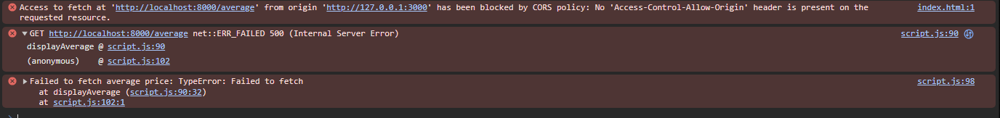

# Lilly Technical Challenge Documentation Template

*This documentation template serves as a place for you to discuss how you approached this challenge, any issues you faced & how you overcame them, or any other points that you feel would be relevant for the interviewers to know. The text in italics is here to guide you - feel free to remove it once you fill out each section!*

***Not every section in this document is required. This is just a template to help get you started. Feel free to add or remove sections as you feel necessary.***

## Approach
*How did you approach this challenge? Did you work through the objectives in any particular order? If so, why? Did you utilize any external resources, such as tutorials, guides, or other materials?*

For this challenge I chose the simplest possible approach, which was just going through each objective on the list one-by-one and only moving onto the next when the previous objective has been completed, treating each objective like a stepping stone. Although the challenge included several objectives, the overall scope remained manageable so I decided that it wasn't necessary to overcomplicate the challenge completion process for myself. 

For completing this challenge I did make use of external resources such as tutorials and guides. Having had limited experience using Python and JavaScript before, W3 schools and GeeksForGeeks (GFG) were very useful for looking at syntax of these programming languages. GFG was also very useful for looking up commands for FastAPI and how to use them as I was having an issue with the Uvicorn web server which will be expanded on in the problems section.

https://www.geeksforgeeks.org/python/python-seek-function/
https://www.w3schools.com/python/default.asp
https://www.geeksforgeeks.org/python/fastapi-uvicorn/

## Objectives - Innovative Solutions
*For the challenge objectives, did you do anything in a particular way that you want to discuss? Is there anything you're particularly proud of that you want to highlight? Did you attempt some objectives multiple times, or go back and re-write particular sections of code? If so, why? Use this space to document any key points you'd like to tell us about.*

## Problems Faced
*Use this space to document and discuss any issues you faced while undertaking this challenge and how you solved them. We recommend doing this proactively as you experience and resolve the issues - make sure you don't forget! (Screenshots are helpful, though not required)*.

One of the problems faced during this challenge involved the implementation of the average function in main.py. My initial solution calculated the average by incrementing a running total within the loop while also manually tracking the number of items being counted using a counter. While this approach was straightforward, it lacked any validation which caused the function to return null values to the frontend and I came up with a better idea for the function as a whole as I refreshed my Python skills.

To address this, I refactored the function to be more robust as I felt my original approach was too primitive. Rather than summing up all of the values within the loop, I first validated each entry and appended only the valid values to a dedicated prices array. This enabled me to use Python's built-in sum() function for aggregation, while a total number of valid records was derived using len().

Null prices 
https://stackoverflow.com/questions/74791379/fastapi-error-loading-asgi-app-could-not-import-module-main

## Evaluation
*How did you feel about the challenge overall? Did some parts go better than others? Did you run out of time? If you were to do this again, and were given more time, what would you do differently?*